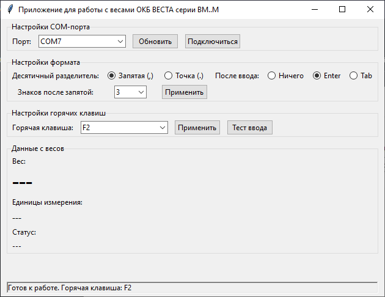

# DataScaleVESTA_BM


Приложение для работы с промышленными весами VESTA BM через COM-порт с возможностью вывода данных по нажатию горячей кнопки, например в программы Excel, Word и тд.

## 📌 Особенности

- Подключение к весам через COM-порт (2400 бод, 8N1, EVEN parity)
- Автоматическое распознавание формата данных (29-байтные пакеты)
- Горячие клавиши для быстрого экспорта данных
- Настройка десятичного разделителя (точка/запятая)
- Выбор действия после ввода значения (нажатие клавиши Enter, Tab)
- Автоматическое переподключение при обрыве связи
- Логирование всех операций

## 🖥️ Скриншот интерфейса



## 🛠 Установка и запуск

1. Клонируйте репозиторий:
```bash
git clone https://github.com/Hasan175/DataScaleVESTA_BM.git
```
Запускайте EXE файл из папки dist или копайте main.
